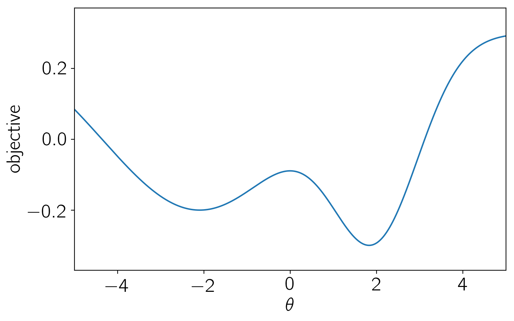
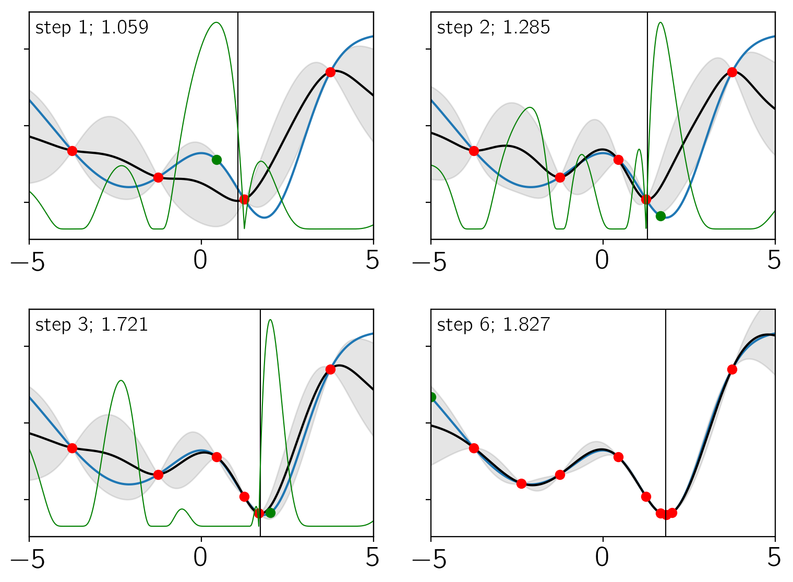

.. note:: This tutorial was generated from an IPython notebook that can be
          downloaded `here <../../_static/notebooks/bayesopt.ipynb>`_.

.. _bayesopt:

Bayesian optimization
=====================

This notebook was made with the following version of george:

.. code:: python

    import george
    george.__version__

.. parsed-literal::

    '0.3.1'

In this tutorial, we'll show a very simple example of implementing
"Bayesian optimization" using george. Now's not the time to get into a
discussion of the issues with the name given to these methods, but I
think that the "Bayesian" part of the title comes from the fact that the
method relies on the (prior) assumption that the objective function is
smooth. The basic idea is that you can reduce the number of function
evaluations needed to minimize a black-box function by using a GP as a
surrogate model. This can be huge if evaluating your model is
computationally expensive. I think that the classic reference is `Jones
et al. (1998) <https://doi.org/10.1023/A:1008306431147>`__ and the
example here will look a bit like their section 4.1.

First, we'll define the scalar objective, parametrized by :math:`\theta`,
that we want to minimize in the range :math:`-5 \le \theta \le 5`.

.. code:: python

    import numpy as np
    import matplotlib.pyplot as plt
    
    def objective(theta):
        return -0.5 * np.exp(-0.5*(theta - 2)**2) - 0.5 * np.exp(-0.5 * (theta + 2.1)**2 / 5) + 0.3
    
    t = np.linspace(-5, 5, 5000)
    
    plt.figure(figsize=(8, 5))
    plt.plot(t, objective(t))
    plt.ylim(-0.37, 0.37)
    plt.xlim(-5, 5)
    plt.xlabel("$\\theta$")
    plt.ylabel("objective");

Now, for the "Bayesian" optimization, the basic procedure that we'll
follow is:

1. Start by evaluating the model at a set of points. In this case, we'll
   start with a uniform grid in :math:`\theta`.
2. Fit a GP (optimize the hyperparameters) to the set of training
   points.
3. Find the input coordinate that maximizes the "expected improvement"
   (see Section 4 of Jones+ 1998). For simplicity, we simply use a grid
   search to maximize this, but this should probably be a numerical
   optimization in any real application of this method.
4. At this new coordinate, run the model and add this as a new training
   point.
5. Return to step 2 until converged. We'll judge convergence using
   relative changes in the location of the minimum.

.. code:: python

    from george import kernels
    from scipy.special import erf
    from scipy.optimize import minimize
    
    N_init = 4
    train_theta = np.linspace(-5, 5, N_init + 1)[1:]
    train_theta -= 0.5 * (train_theta[1] - train_theta[0])
    train_f = objective(train_theta)
    
    gp = george.GP(np.var(train_f) * kernels.Matern52Kernel(3.0),
                   fit_mean=True)
    gp.compute(train_theta)
    
    def nll(params):
        gp.set_parameter_vector(params)
        g = gp.grad_log_likelihood(train_f, quiet=True)
        return -gp.log_likelihood(train_f, quiet=True), -g
    
    fig, axes = plt.subplots(2, 2, figsize=(8, 6))
    j = 0
    old_min = None
    converged = False
    
    for i in range(1000):
        # Update the GP parameters
        soln = minimize(nll, gp.get_parameter_vector(), jac=True)
    
        # Compute the acquisition function
        mu, var = gp.predict(train_f, t, return_var=True)
        std = np.sqrt(var)    
        f_min = np.min(train_f)
        chi = (f_min - mu) / std 
        Phi = 0.5 * (1.0 + erf(chi / np.sqrt(2)))
        phi = np.exp(-0.5 * chi**2) / np.sqrt(2*np.pi*var)
        A_ei = (f_min - mu) * Phi + var * phi
        A_max = t[np.argmax(A_ei)]
    
        # Add a new point
        train_theta = np.append(train_theta, A_max)
        train_f = np.append(train_f, objective(train_theta[-1]))
        gp.compute(train_theta)
        
        # Estimate the minimum - I'm sure that there's a better way!
        i_min = np.argmin(mu)
        sl = slice(max(0, i_min - 1), min(len(t), i_min + 2))
        ts = t[sl]
        D = np.vander(np.arange(len(ts)).astype(float))
        w = np.linalg.solve(D, mu[sl])
        minimum = ts[0] + (ts[1] - ts[0]) * np.roots(np.polyder(w[::-1]))
        
        # Check convergence
        if i > 0 and np.abs((old_min - minimum) / minimum) < 1e-5:
            converged = True
        old_min = float(minimum[0])
        
        # Make the plots
        if converged or i in [0, 1, 2]:
            ax = axes.flat[j]
            j += 1
            ax.plot(t, objective(t))
            ax.plot(t, mu, "k")
            ax.plot(train_theta[:-1], train_f[:-1], "or")
            ax.plot(train_theta[-1], train_f[-1], "og")
            ax.fill_between(t, mu+std, mu-std, color="k", alpha=0.1)
            if i <= 3:
                ax2 = ax.twinx()
                ax2.plot(t, A_ei, "g", lw=0.75)
                ax2.set_yticks([])
            ax.axvline(old_min, color="k", lw=0.75)
            ax.set_ylim(-0.37, 0.37)
            ax.set_xlim(-5, 5)
            ax.set_yticklabels([])
            ax.annotate("step {0}; {1:.3f}".format(i+1, old_min), xy=(0, 1),
                        xycoords="axes fraction", ha="left", va="top",
                        xytext=(5, -5), textcoords="offset points",
                        fontsize=14)
        
        if converged:
            break
    
    plt.tight_layout()
    
    print("{0} model evaluations".format(len(train_f)))

.. parsed-literal::

    10 model evaluations

There's a lot going on in these plots. Each panel shows the results
after a certain iteration (indicated in the top left corner of the
panel). In each panel:

1. The blue line is the true objective function.
2. The black line and gray contours indicate the current estimate of the
   objective using the GP model.
3. The green line is the expected improvement.
4. The red points are the training set.
5. The green point is the new point that was added at this step.
6. The vertical black line is the current estimate of the location
   minimum. This is also indicated in the top left corner of the panel.

As you can see, only 10 model evaluations (including the original
training set) were needed to converge to the correct minimum. In this
simple example, there are certainly other methods that could have easily
been used to minimize this function, but you can imagine that this
method could be useful for cases where ``objective`` is very expensive
to compute.

