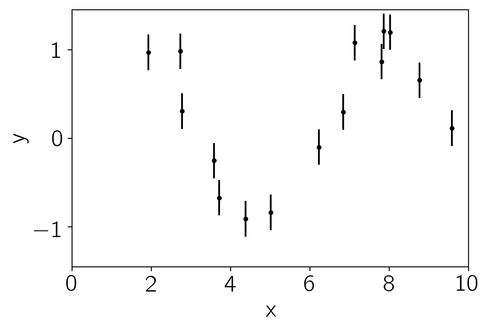
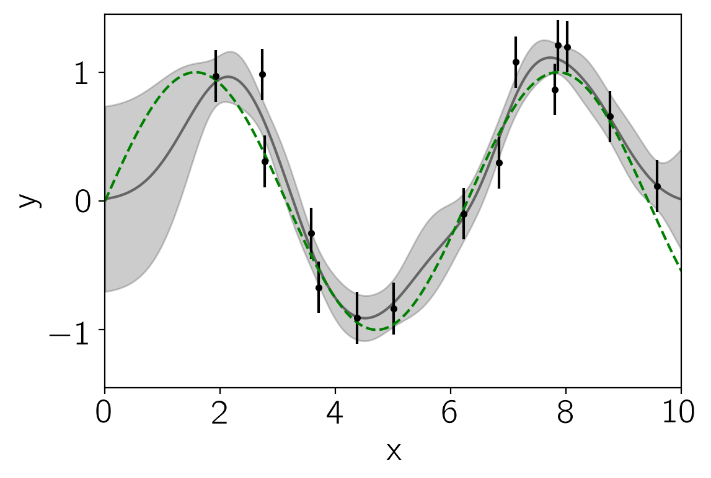
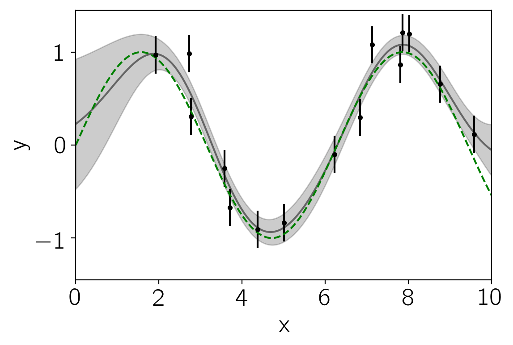

.. note:: This tutorial was generated from an IPython notebook that can be
          downloaded `here <../../_static/notebooks/first.ipynb>`_.

.. _first:

A gentle introduction to Gaussian Process Regression
====================================================

This notebook was made with the following version of george:

.. code:: python

    import george
    george.__version__

.. parsed-literal::

    '0.3.1'

We'll start by generating some fake data (from a sinusoidal model) with
error bars:

.. code:: python

    import numpy as np
    import matplotlib.pyplot as pl
    
    np.random.seed(1234)
    x = 10 * np.sort(np.random.rand(15))
    yerr = 0.2 * np.ones_like(x)
    y = np.sin(x) + yerr * np.random.randn(len(x))
    
    pl.errorbar(x, y, yerr=yerr, fmt=".k", capsize=0)
    pl.xlim(0, 10)
    pl.ylim(-1.45, 1.45)
    pl.xlabel("x")
    pl.ylabel("y");

Now, we'll choose a kernel (covariance) function to model these data,
assume a zero mean model, and predict the function values across the
full range. The full kernel specification language is documented
`here <../../user/kernels/>`__ but here's an example for this dataset:

.. code:: python

    from george import kernels
    
    kernel = np.var(y) * kernels.ExpSquaredKernel(0.5)
    gp = george.GP(kernel)
    gp.compute(x, yerr)
    
    x_pred = np.linspace(0, 10, 500)
    pred, pred_var = gp.predict(y, x_pred, return_var=True)
    
    pl.fill_between(x_pred, pred - np.sqrt(pred_var), pred + np.sqrt(pred_var),
                    color="k", alpha=0.2)
    pl.plot(x_pred, pred, "k", lw=1.5, alpha=0.5)
    pl.errorbar(x, y, yerr=yerr, fmt=".k", capsize=0)
    pl.plot(x_pred, np.sin(x_pred), "--g")
    pl.xlim(0, 10)
    pl.ylim(-1.45, 1.45)
    pl.xlabel("x")
    pl.ylabel("y");

The ``gp`` model provides a handler for computing the marginalized
likelihood of the data under this model:

.. code:: python

    print("Initial ln-likelihood: {0:.2f}".format(gp.log_likelihood(y)))

.. parsed-literal::

    Initial ln-likelihood: -11.82

So we can use this—combined with scipy's
`minimize <http://docs.scipy.org/doc/scipy/reference/generated/scipy.optimize.minimize.html>`__
function—to fit for the maximum likelihood parameters:

.. code:: python

    from scipy.optimize import minimize
    
    def neg_ln_like(p):
        gp.set_parameter_vector(p)
        return -gp.log_likelihood(y)
    
    def grad_neg_ln_like(p):
        gp.set_parameter_vector(p)
        return -gp.grad_log_likelihood(y)
    
    result = minimize(neg_ln_like, gp.get_parameter_vector(), jac=grad_neg_ln_like)
    print(result)
    
    gp.set_parameter_vector(result.x)
    print("\nFinal ln-likelihood: {0:.2f}".format(gp.log_likelihood(y)))

.. parsed-literal::

          fun: 9.225282556043894
     hess_inv: array([[ 0.52320809,  0.30041273],
           [ 0.30041273,  0.40708074]])
          jac: array([ -5.07047669e-06,   2.56077806e-06])
      message: 'Optimization terminated successfully.'
         nfev: 10
          nit: 8
         njev: 10
       status: 0
      success: True
            x: array([-0.48730733,  0.60407551])
    
    Final ln-likelihood: -9.23

And plot the maximum likelihood model:

.. code:: python

    pred, pred_var = gp.predict(y, x_pred, return_var=True)
    
    pl.fill_between(x_pred, pred - np.sqrt(pred_var), pred + np.sqrt(pred_var),
                    color="k", alpha=0.2)
    pl.plot(x_pred, pred, "k", lw=1.5, alpha=0.5)
    pl.errorbar(x, y, yerr=yerr, fmt=".k", capsize=0)
    pl.plot(x_pred, np.sin(x_pred), "--g")
    pl.xlim(0, 10)
    pl.ylim(-1.45, 1.45)
    pl.xlabel("x")
    pl.ylabel("y");

And there you have it! Read on to see what else you can do with george
or just dive right into your own problem.

Finally, don't forget `Rasmussen &
Williams <http://www.gaussianprocess.org/gpml/>`__, the reference for
everything Gaussian Process.

