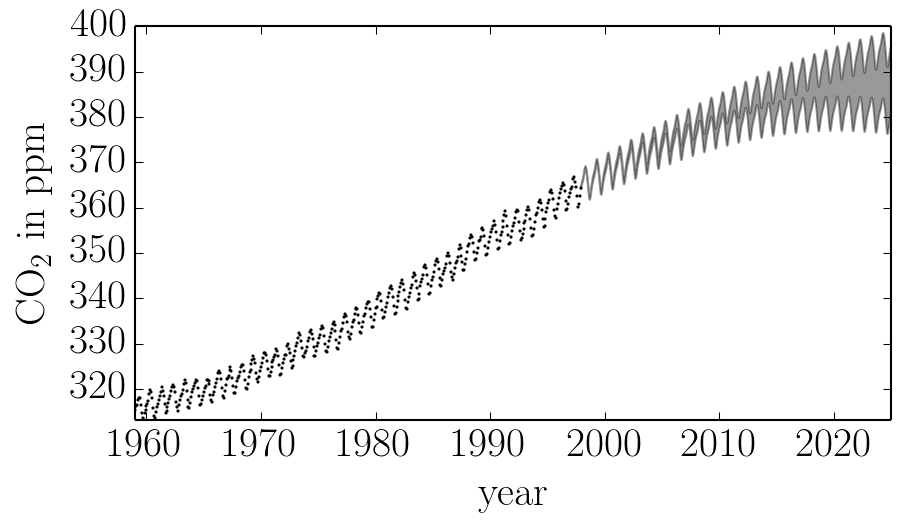

.. module:: george

.. _hyper:

Tutorial: setting the hyperparameters
=====================================

In this demo, we'll reproduce the analysis for Figure 5.6 in `Chapter 5 of
Rasmussen & Williams (R&W)
<http://www.gaussianprocess.org/gpml/chapters/RW5.pdf>`_.
The data are measurements of the atmospheric CO2 concentration made at Mauna
Loa, Hawaii (Keeling & Whorf 2004).
The dataset is said to be available online but I couldn't seem to download it
from the original source.
Luckily the `statsmodels <http://statsmodels.sourceforge.net/>`_ package
`includes a copy
<http://statsmodels.sourceforge.net/devel/datasets/generated/co2.html>`_ that
we can load as follows:

.. code-block:: python

    import numpy as np
    import statsmodels.api as sm

    data = sm.datasets.get_rdataset("co2").data
    t = np.array(data.time)
    y = np.array(data.co2)

These data are plotted in the figure below:

.. image:: ../_static/hyper/data.png

In this figure, you can see that there is periodic (or quasi-periodic) signal
with a year-long period superimposed on a long term trend.
We will follow R&W and model these effects non-parametrically using a
complicated covariance function.
The covariance function that we'll use is:

.. math::

    k(r) = k_1(r) + k_2(r) + k_3(r) + k_4(r)

where

.. math::

    \begin{eqnarray}
    k_1(r) &=& \theta_1^2 \, \exp \left(-\frac{r^2}{2\,\theta_2} \right) \\
    k_2(r) &=& \theta_3^2 \, \exp \left(-\frac{r^2}{2\,\theta_4}
                                         -\theta_5\,\sin^2\left(
                                         \frac{\pi\,r}{\theta_6}\right)
                                        \right) \\
    k_3(r) &=& \theta_7^2 \, \left [ 1 + \frac{r^2}{2\,\theta_8\,\theta_9}
                             \right ]^{-\theta_8} \\
    k_4(r) &=& \theta_{10}^2 \, \exp \left(-\frac{r^2}{2\,\theta_{11}} \right)
                + \theta_{12}^2\,\delta_{ij}
    \end{eqnarray}

We can implement this kernel in George as follows (we'll use the R&W results
as the hyperparameters for now):

.. code-block:: python

    from george import kernels

    k1 = 66.0**2 * kernels.ExpSquaredKernel(67.0**2)
    k2 = 2.4**2 * kernels.ExpSquaredKernel(90**2) * kernels.ExpSine2Kernel(2.0 / 1.3**2, 1.0)
    k3 = 0.66**2 * kernels.RationalQuadraticKernel(0.78, 1.2**2)
    k4 = 0.18**2 * kernels.ExpSquaredKernel(1.6**2) + kernels.WhiteKernel(0.19)
    kernel = k1 + k2 + k3 + k4

Optimization
------------

If we want to find the "best-fit" hyperparameters, we should *optimize* an
objective function.
The two standard functions (as described in Chapter 5 of R&W) are the
marginalized ln-likelihood and the cross validation likelihood.
George implements the former in the :func:`GP.lnlikelihood` function and the
gradient with respect to the hyperparameters in the
:func:`GP.grad_lnlikelihood` function:

.. code-block:: python

    import george
    gp = george.GP(kernel, mean=np.mean(y))
    gp.compute(t)
    print(gp.lnlikelihood(y))
    print(gp.grad_lnlikelihood(y))

The gradient is taken with respect to the ``vector`` property of the kernel so
this is what you want to fit for.
For most kernels the vector is actually the *logarithm* of the hyperparameters
(see the discussion in :ref:`implementation`).
We'll use a gradient based optimization routine from SciPy to fit this model
as follows:

.. code-block:: python

    import scipy.optimize as op

    # Define the objective function (negative log-likelihood in this case).
    def nll(p):
        # Update the kernel parameters and compute the likelihood.
        gp.kernel[:] = p
        ll = gp.lnlikelihood(y, quiet=True)

        # The scipy optimizer doesn't play well with infinities.
        return -ll if np.isfinite(ll) else 1e25

    # And the gradient of the objective function.
    def grad_nll(p):
        # Update the kernel parameters and compute the likelihood.
        gp.kernel[:] = p
        return -gp.grad_lnlikelihood(y, quiet=True)

    # You need to compute the GP once before starting the optimization.
    gp.compute(t)

    # Print the initial ln-likelihood.
    print(gp.lnlikelihood(y))

    # Run the optimization routine.
    p0 = gp.kernel.vector
    results = op.minimize(nll, p0, jac=grad_nll, method="L-BFGS-B")

    # Update the kernel and print the final log-likelihood.
    gp.kernel[:] = results.x
    print(gp.lnlikelihood(y))

.. warning:: An optimization code something like this should work on most
    problems but the results can be very sensitive to your choice of
    initialization and algorithm. If the results are nonsense, try choosing a
    better initial guess or try a different value of the ``method`` parameter
    in ``op.minimize``.

After running this optimization, we find a final ln-likelihood of -82.46
(slightly better than the result in R&W) and the following parameter values:

.. include:: ../_static/hyper/results.txt

We can plot our prediction of the CO2 concentration into the future using our
optimized Gaussian process model by running:

.. code-block:: python

    x = np.linspace(max(t), 2025, 2000)
    mu, cov = gp.predict(y, x)
    std = np.sqrt(np.diag(cov))

and this gives a result just like Figure 5.6 from R&W:

Sampling & Marginalization
--------------------------

The prediction made in the previous section take into account uncertainties
due to the fact that a Gaussian process is stochastic but it doesn't take into
account any uncertainties in the *values of the hyperparameters*.
This won't matter if the hyperparameters are very well constrained by the data
but in this case, many of the parameters are actually poorly constrained.
To take this effect into account, we can apply prior probability functions to
the hyperparameters and marginalize using `Markov chain Monte Carlo (MCMC)
<http://en.wikipedia.org/wiki/Markov_chain_Monte_Carlo>`_.
To do this, we'll use the `emcee <http://dan.iel.fm/emcee>`_ package.

First, we define the probabilistic model:

.. code-block:: python

    def lnprob(p):
        # Trivial improper prior: uniform in the log.
        if np.any((-10 > p) + (p > 10)):
            return -np.inf
        lnprior = 0.0

        # Update the kernel and compute the lnlikelihood.
        kernel.pars = np.exp(p)
        return lnprior + gp.lnlikelihood(y, quiet=True)

In this function, we've applied a prior on every parameter that is uniform in
the natural log between -10 and 10.
The ``quiet`` argument in the call to :func:`GP.lnlikelihood` means that that
function will return ``-numpy.inf`` if the kernel is invalid or if there are
any linear algebra errors (otherwise it would raise an exception).

Then, we run the sampler (this will probably take a while to run if you want
to repeat this analysis):

.. code-block:: python

    import emcee

    # You need to compute the GP once before starting. Then the sample list
    # will be saved.
    gp.compute(t)

    # Set up the sampler.
    nwalkers, ndim = 36, len(kernel)
    sampler = emcee.EnsembleSampler(nwalkers, ndim, lnprob)

    # Initialize the walkers.
    p0 = [np.log(kernel.pars) + 1e-4 * np.random.randn(ndim)
          for i in range(nwalkers)]

    print("Running burn-in")
    p0, _, _ = sampler.run_mcmc(p0, 2000)

    print("Running production chain")
    sampler.run_mcmc(p0, 2000)

After this run, you can plot 50 samples from the marginalized predictive
probability distribution:

.. code-block:: python

    import matplotlib.pyplot as pl

    x = np.linspace(max(t), 2025, 250)
    for i in range(50):
        # Choose a random walker and step.
        w = np.random.randint(chain.shape[0])
        n = np.random.randint(2000, chain.shape[1])
        gp.kernel.pars = np.exp(chain[w, n])

        # Plot a single sample.
        pl.plot(x, gp.sample_conditional(y, x), "k", alpha=0.3)

This should give you a figure similar to this one:

.. image:: ../_static/hyper/mcmc.png

Comparing this to the same figure in the previous section, you'll notice that
the error bars on the prediction are now substantially larger than before.
This is because we are now considering all the predictions that are consistent
with the data, not just the "best" prediction.
In general, even though it requires much more computation, it is more
conservative (and honest) to take all these sources of uncertainty into
account.
