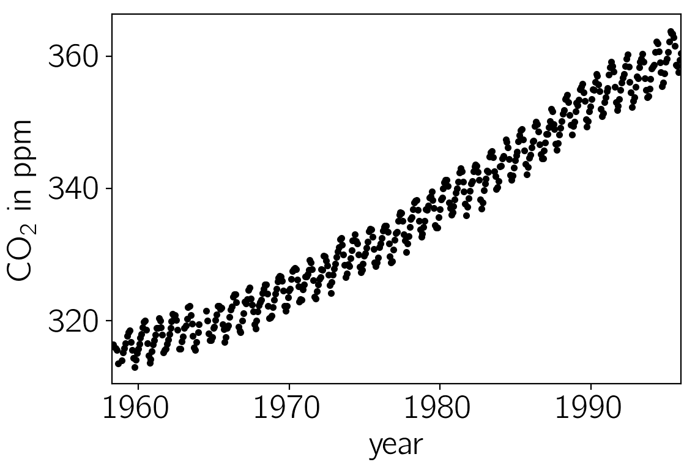
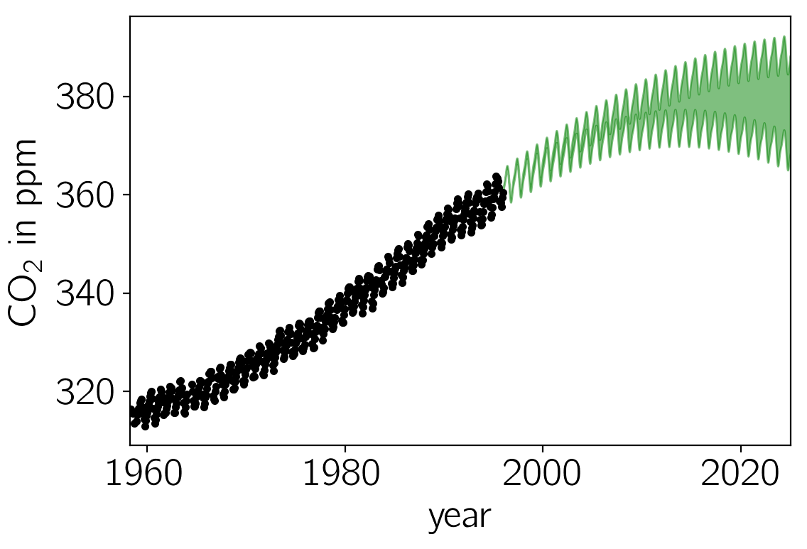
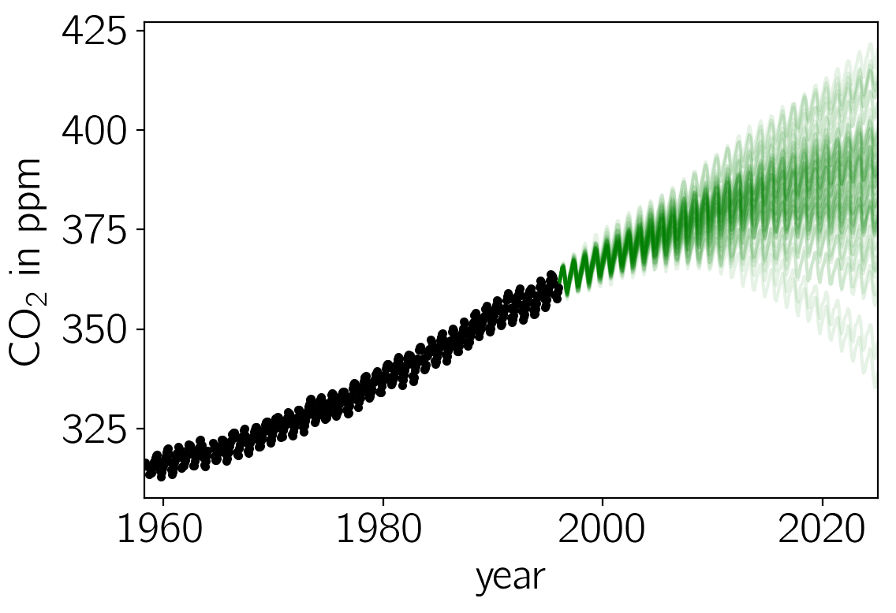

.. note:: This tutorial was generated from an IPython notebook that can be
          downloaded `here <../../_static/notebooks/hyper.ipynb>`_.

.. _hyper:

Hyperparameter optimization
===========================

This notebook was made with the following version of george:

.. code:: python

    import george
    george.__version__

.. parsed-literal::

    '0.3.1'

In this tutorial, we’ll reproduce the analysis for Figure 5.6 in
`Chapter 5 of Rasmussen & Williams
(R&W) <http://www.gaussianprocess.org/gpml/chapters/RW5.pdf>`__. The
data are measurements of the atmospheric CO2 concentration made at Mauna
Loa, Hawaii (Keeling & Whorf 2004). The dataset is said to be available
online but I couldn’t seem to download it from the original source.
Luckily the `statsmodels <http://statsmodels.sourceforge.net/>`__
package `includes a
copy <http://statsmodels.sourceforge.net/devel/datasets/generated/co2.html>`__
that we can load as follows:

.. code:: python

    import numpy as np
    import matplotlib.pyplot as pl
    from statsmodels.datasets import co2
    
    data = co2.load_pandas().data
    t = 2000 + (np.array(data.index.to_julian_date()) - 2451545.0) / 365.25
    y = np.array(data.co2)
    m = np.isfinite(t) & np.isfinite(y) & (t < 1996)
    t, y = t[m][::4], y[m][::4]
    
    pl.plot(t, y, ".k")
    pl.xlim(t.min(), t.max())
    pl.xlabel("year")
    pl.ylabel("CO$_2$ in ppm");

In this figure, you can see that there is periodic (or quasi-periodic)
signal with a year-long period superimposed on a long term trend. We
will follow R&W and model these effects non-parametrically using a
complicated covariance function. The covariance function that we’ll use
is:

.. math:: k(r) = k_1(r) + k_2(r) + k_3(r) + k_4(r)

where

.. math::

   \begin{eqnarray}
       k_1(r) &=& \theta_1^2 \, \exp \left(-\frac{r^2}{2\,\theta_2} \right) \\
       k_2(r) &=& \theta_3^2 \, \exp \left(-\frac{r^2}{2\,\theta_4}
                                            -\theta_5\,\sin^2\left(
                                            \frac{\pi\,r}{\theta_6}\right)
                                           \right) \\
       k_3(r) &=& \theta_7^2 \, \left [ 1 + \frac{r^2}{2\,\theta_8\,\theta_9}
                                \right ]^{-\theta_8} \\
       k_4(r) &=& \theta_{10}^2 \, \exp \left(-\frac{r^2}{2\,\theta_{11}} \right)
                   + \theta_{12}^2\,\delta_{ij}
   \end{eqnarray}

We can implement this kernel in George as follows (we'll use the R&W
results as the hyperparameters for now):

.. code:: python

    from george import kernels
    
    k1 = 66**2 * kernels.ExpSquaredKernel(metric=67**2)
    k2 = 2.4**2 * kernels.ExpSquaredKernel(90**2) * kernels.ExpSine2Kernel(gamma=2/1.3**2, log_period=0.0)
    k3 = 0.66**2 * kernels.RationalQuadraticKernel(log_alpha=np.log(0.78), metric=1.2**2)
    k4 = 0.18**2 * kernels.ExpSquaredKernel(1.6**2)
    kernel = k1 + k2 + k3 + k4

Optimization
------------

If we want to find the "best-fit" hyperparameters, we should *optimize*
an objective function. The two standard functions (as described in
Chapter 5 of R&W) are the marginalized ln-likelihood and the cross
validation likelihood. George implements the former in the
``GP.lnlikelihood`` function and the gradient with respect to the
hyperparameters in the ``GP.grad_lnlikelihood`` function:

.. code:: python

    import george
    gp = george.GP(kernel, mean=np.mean(y), fit_mean=True,
                   white_noise=np.log(0.19**2), fit_white_noise=True)
    gp.compute(t)
    print(gp.log_likelihood(y))
    print(gp.grad_log_likelihood(y))

.. parsed-literal::

    -608.938634447
    [  1.20325990e-02   5.65011826e+02   4.94824823e-02  -1.20640197e+00
       3.33835864e+00   2.43343814e-01   7.10415081e+00  -5.38311429e+03
       1.96801995e+01  -2.05383850e+01  -5.36816015e+01  -1.32619973e-02
      -6.14334711e-03]

We'll use a gradient based optimization routine from SciPy to fit this
model as follows:

.. code:: python

    import scipy.optimize as op
    
    # Define the objective function (negative log-likelihood in this case).
    def nll(p):
        gp.set_parameter_vector(p)
        ll = gp.log_likelihood(y, quiet=True)
        return -ll if np.isfinite(ll) else 1e25
    
    # And the gradient of the objective function.
    def grad_nll(p):
        gp.set_parameter_vector(p)
        return -gp.grad_log_likelihood(y, quiet=True)
    
    # You need to compute the GP once before starting the optimization.
    gp.compute(t)
    
    # Print the initial ln-likelihood.
    print(gp.log_likelihood(y))
    
    # Run the optimization routine.
    p0 = gp.get_parameter_vector()
    results = op.minimize(nll, p0, jac=grad_nll, method="L-BFGS-B")
    
    # Update the kernel and print the final log-likelihood.
    gp.set_parameter_vector(results.x)
    print(gp.log_likelihood(y))

.. parsed-literal::

    -608.938634447
    -299.16486543

**Warning:** *An optimization code something like this should work on
most problems but the results can be very sensitive to your choice of
initialization and algorithm. If the results are nonsense, try choosing
a better initial guess or try a different value of the ``method``
parameter in ``op.minimize``.*

We can plot our prediction of the CO2 concentration into the future
using our optimized Gaussian process model by running:

.. code:: python

    x = np.linspace(max(t), 2025, 2000)
    mu, var = gp.predict(y, x, return_var=True)
    std = np.sqrt(var)
    
    pl.plot(t, y, ".k")
    pl.fill_between(x, mu+std, mu-std, color="g", alpha=0.5)
    
    pl.xlim(t.min(), 2025)
    pl.xlabel("year")
    pl.ylabel("CO$_2$ in ppm");

Sampling & Marginalization
--------------------------

The prediction made in the previous section take into account
uncertainties due to the fact that a Gaussian process is stochastic but
it doesn’t take into account any uncertainties in the values of the
hyperparameters. This won’t matter if the hyperparameters are very well
constrained by the data but in this case, many of the parameters are
actually poorly constrained. To take this effect into account, we can
apply prior probability functions to the hyperparameters and marginalize
using Markov chain Monte Carlo (MCMC). To do this, we’ll use the
`emcee <http://dfm.io/emcee>`__ package.

First, we define the probabilistic model:

.. code:: python

    def lnprob(p):
        # Trivial uniform prior.
        if np.any((-100 > p[1:]) + (p[1:] > 100)):
            return -np.inf
    
        # Update the kernel and compute the lnlikelihood.
        gp.set_parameter_vector(p)
        return gp.lnlikelihood(y, quiet=True)

In this function, we’ve applied a prior on every parameter that is
uniform between -100 and 100 for every parameter. In real life, you
should probably use something more intelligent but this will work for
this problem. The quiet argument in the call to ``GP.lnlikelihood()``
means that that function will return ``-numpy.inf`` if the kernel is
invalid or if there are any linear algebra errors (otherwise it would
raise an exception).

Then, we run the sampler (this will probably take a while to run if you
want to repeat this analysis):

.. code:: python

    import emcee
    
    gp.compute(t)
    
    # Set up the sampler.
    nwalkers, ndim = 36, len(gp)
    sampler = emcee.EnsembleSampler(nwalkers, ndim, lnprob)
    
    # Initialize the walkers.
    p0 = gp.get_parameter_vector() + 1e-4 * np.random.randn(nwalkers, ndim)
    
    print("Running burn-in")
    p0, _, _ = sampler.run_mcmc(p0, 200)
    
    print("Running production chain")
    sampler.run_mcmc(p0, 200);

.. parsed-literal::

    Running burn-in
    Running production chain

After this run, you can plot 50 samples from the marginalized predictive
probability distribution:

.. code:: python

    x = np.linspace(max(t), 2025, 250)
    for i in range(50):
        # Choose a random walker and step.
        w = np.random.randint(sampler.chain.shape[0])
        n = np.random.randint(sampler.chain.shape[1])
        gp.set_parameter_vector(sampler.chain[w, n])
    
        # Plot a single sample.
        pl.plot(x, gp.sample_conditional(y, x), "g", alpha=0.1)
        
    pl.plot(t, y, ".k")
    
    pl.xlim(t.min(), 2025)
    pl.xlabel("year")
    pl.ylabel("CO$_2$ in ppm");

.. parsed-literal::

    /Users/dforeman/research/projects/george/george/utils.py:30: RuntimeWarning: covariance is not positive-semidefinite.
      samples = np.random.multivariate_normal(mean, matrix, N)

Comparing this to the same figure in the previous section, you’ll notice
that the error bars on the prediction are now substantially larger than
before. This is because we are now considering all the predictions that
are consistent with the data, not just the “best” prediction. In
general, even though it requires much more computation, it is more
conservative (and honest) to take all these sources of uncertainty into
account.

