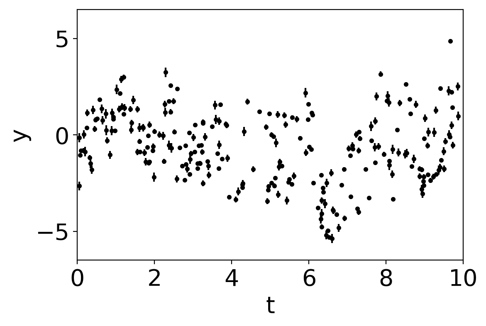
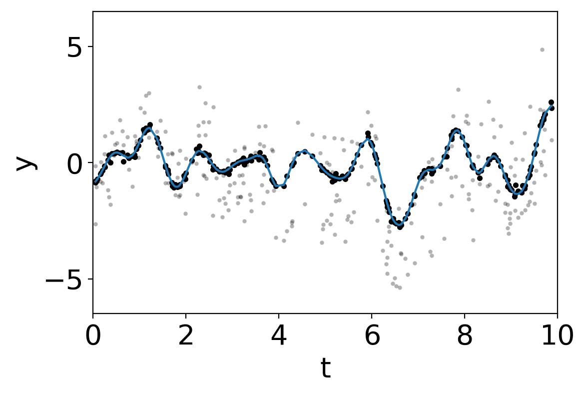

.. note:: This tutorial was generated from an IPython notebook that can be
          downloaded `here <../../_static/notebooks/mixture.ipynb>`_.

.. _mixture:

Mixtures of GPs
===============

This notebook was made with the following version of george:

.. code:: python

    import george
    george.__version__

.. parsed-literal::

    '0.3.1'

It can be useful to model a dataset using a mixture of GPs. For example,
the data might have both systematic effects and a physical signal that
can be modeled using a GP. I konw of a few examples where this method
has been used in the context of time series analysis for the discovery
of transiting exoplanets (for example, `Aigrain et al.
2016 <https://arxiv.org/abs/1603.09167>`__ and `Luger et al.
2016 <https://arxiv.org/abs/1607.00524>`__), but I'm sure that these
aren't the earliest references. The idea is pretty simple: if your model
is a mixture of two GPs (with covariance matrices :math:`K_1` and
:math:`K_2` respectively), this is equivalent to a single GP where the
kernel is the sum of two kernels, one for each component
(:math:`K = K_1 + K_2`). In this case, the equation for the predictive
mean conditioned on a dataset :math:`\boldsymbol{y}` is

.. math::

   \boldsymbol{\mu} = (K_1 + K_2)\,(K_1 + K_2 + N)^{-1} \, \boldsymbol{y}

where :math:`N` is the (possibly diagonal) matrix describing the
measurement uncertainties. It turns out that the equation for computing
the predictive mean for component 1 is simply

.. math::

   \boldsymbol{\mu}_1 = K_1\,(K_1 + K_2 + N)^{-1} \, \boldsymbol{y}

and the equivalent expression can be written for component 2.

This can be implemented in george using the new ``kernel`` keyword
argument in the ``predict`` method. To demonstrate this, let's start by
generating a synthetic dataset. Component 1 is a systematic signal that
depends on two input parameters (:math:`t` and :math:`\theta` following
Aigrain) and component 2 is a quasiperiodic oscillation that is the
target of our analysis.

.. code:: python

    import numpy as np
    import matplotlib.pyplot as plt
    
    from george import kernels
    
    np.random.seed(42)
    N = 256
    t = np.sort(np.random.uniform(0, 10, N))
    theta = np.random.uniform(-np.pi, np.pi, N)
    X = np.vstack((t, theta)).T
    yerr = np.random.uniform(0.05, 0.25, N)
    
    kernel1 = 2.0 * kernels.Matern32Kernel([5.0, 0.5], ndim=2)
    kernel2 = 2.0 * kernels.ExpSine2Kernel(gamma=10.0, log_period=np.log(5.), ndim=2, axes=0)
    kernel2 *= kernels.ExpSquaredKernel([15.0], ndim=2, axes=0)
    kernel = kernel1 + kernel2
    
    gp = george.GP(kernel)
    y = gp.sample(X)
    y += yerr * np.random.randn(N)
    gp.compute(X, yerr)
    
    plt.errorbar(t, y, yerr=yerr, fmt=".k", capsize=0)
    plt.ylim(-6.5, 6.5)
    plt.xlim(0, 10)
    plt.xlabel("t")
    plt.ylabel("y");

The physical (oscillatory) component is not obvious in this dataset
because it is swamped by the systematics. Now, we'll find the maximum
likelihood hyperparameters by numerically minimizing the negative
log-likelihood function.

.. code:: python

    from scipy.optimize import minimize
    
    def nll(params):
        gp.set_parameter_vector(params)
        l = gp.log_likelihood(y, quiet=True)
        g = gp.grad_log_likelihood(y, quiet=True)
        return -l, -g
    
    params = gp.get_parameter_vector()
    params += 0.05*np.random.randn(len(params))
    soln = minimize(nll, params, jac=True)
    gp.set_parameter_vector(soln.x)
    print(soln.success, soln.x)

.. parsed-literal::

    True [  0.38315985   1.88867446  -0.35673864  -0.33250025  11.98452994
       1.59429178   2.11371316]

Now let's use the trick from above to compute the prediction of
component 1 and remove it to see the periodic signal.

.. code:: python

    # Compute the predictive means - note the "kernel" argument
    mu1 = gp.predict(y, X, return_cov=False, kernel=kernel1)
    mu2 = gp.predict(y, X, return_cov=False, kernel=kernel2)
    
    plt.plot(t, y, ".k", mec="none", alpha=0.3)
    plt.plot(t, y - mu1, ".k")
    plt.plot(t, mu2)
    
    plt.ylim(-6.5, 6.5)
    plt.xlim(0, 10)
    plt.xlabel("t")
    plt.ylabel("y");

In this plot, the original dataset is plotted in light gray points and
the "de-trended" data with component 1 removed is plotted as black
points. The prediction of the GP model for component 2 is shown as a
blue line.

