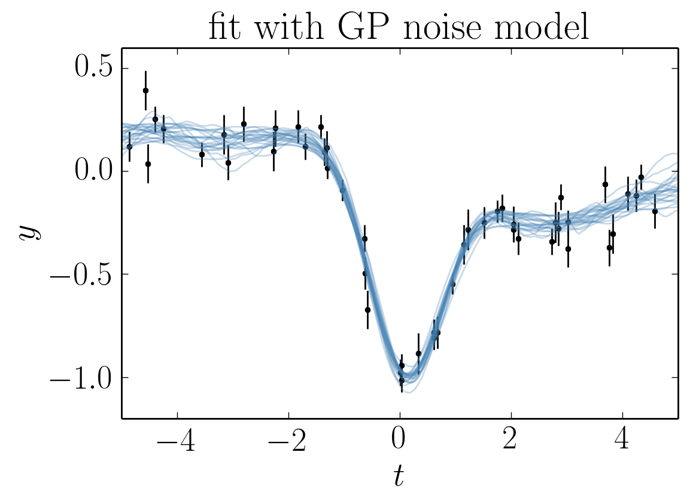
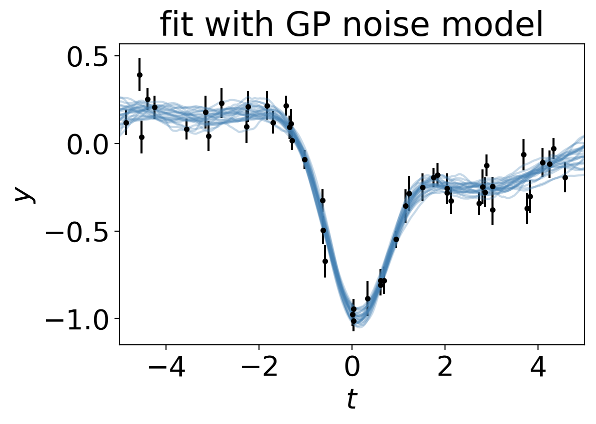

Tutorial: model fitting with correlated noise
=============================================

This tutorial was generated from an IPython notebook that `can be
downloaded here <../../_static/notebooks/model.ipynb>`__. It was made
with the following version of george:

.. code:: python

    import george
    george.__version__

.. parsed-literal::

    '1.0.0.dev0'

In this example, we’re going to simulate a common data analysis
situation where our dataset exhibits unknown correlations in the noise.
When taking data, it is often possible to estimate the independent
measurement uncertainty on a single point (due to, for example, Poisson
counting statistics) but there are often residual systematics that
correlate data points. The effect of this correlated noise can often be
hard to estimate but ignoring it can introduce substantial biases into
your inferences. In the following sections, we will consider a synthetic
dataset with correlated noise and a simple non-linear model. We will
start by fitting the model assuming that the noise is uncorrelated and
then improve on this model by modeling the covariance structure in the
data using a Gaussian process.

A Simple Mean Model
-------------------

The model that we’ll fit in this demo is a single Gaussian feature with
three parameters: amplitude :math:`\alpha`, location :math:`\ell`, and
width :math:`\sigma^2`. I’ve chosen this model because is is the
simplest non-linear model that I could think of, and it is qualitatively
similar to a few problems in astronomy (fitting spectral features,
measuring transit times, etc.).

Simulated Dataset
-----------------

Let's start by simulating a dataset of 50 points with known correlated
noise. In fact, this example is somewhat artificial since the data were
drawn from a Gaussian process but in everything that follows, we’ll use
a different kernel function for our inferences in an attempt to make the
situation slightly more realistic. A known white variance was also added
to each data point.

Using the parameters

.. math:: \alpha = −1 \quad, \quad\quad \ell = 0.1 \quad, \quad\quad \sigma^2 = 0.4 \quad.

the resulting dataset is:

.. code:: python

    import numpy as np
    import matplotlib.pyplot as pl
    from george import kernels
    
    np.random.seed(1234)
    
    def model(params, t):
        amp, loc, sig2 = params
        return amp * np.exp(-0.5 * (t - loc) ** 2 / sig2)
    
    def generate_data(params, N, rng=(-5, 5)):
        gp = george.GP(0.1 * kernels.ExpSquaredKernel(3.3))
        t = rng[0] + np.diff(rng) * np.sort(np.random.rand(N))
        y = gp.sample(t)
        y += model(params, t)
        yerr = 0.05 + 0.05 * np.random.rand(N)
        y += yerr * np.random.randn(N)
        return t, y, yerr
    
    truth = [-1.0, 0.1, 0.4]
    t, y, yerr = generate_data(truth, 50)
    
    pl.errorbar(t, y, yerr=yerr, fmt=".k", capsize=0)
    pl.ylabel(r"$y$")
    pl.xlabel(r"$t$")
    pl.xlim(-5, 5)
    pl.title("simulated data");

.. image:: model_files/model_4_0.png

Assuming White Noise
--------------------

Let's start by doing the standard thing and assuming that the noise is
uncorrelated. In this case, the ln-likelihood function of the data
:math:`\{y_n\}` given the parameters :math:`\theta` is

.. math::

       \ln p(\{y_n\}\,|\,\{t_n\},\,\{\sigma_n^2\},\,\theta) =
           -\frac{1}{2}\,\sum_{n=1}^N \frac{[y_n - f_\theta(t_n)]^2}{\sigma_n^2}
           + A

where :math:`A` doesn't depend on :math:`\theta` so it is irrelevant for
our purposes and :math:`f_\theta(t)` is our model function.

It is clear that there is some sort of systematic trend in the data and
we don't want to ignore that so we'll simultaneously model a linear
trend and the Gaussian feature described in the previous section.
Therefore, our model is

.. math::

       f_\theta (t) = m\,t + b +
           \alpha\,\exp\left(-\frac{[t-\ell]^2}{2\,\sigma^2} \right)

where :math:`\theta` is the 5-dimensional parameter vector

.. math::

       \theta = \{ m,\,b,\,\alpha,\,\ell,\,\sigma^2 \} \quad.

The following code snippet is a simple implementation of this model in
Python.

.. code:: python

    def model1(params, t):
        m, b = params[:2]
        return m*t + b + model(params[2:], t)
    
    def lnlike1(p):
        return -0.5 * np.sum(((y - model1(p, t))/yerr) ** 2)

To fit this model using MCMC (using `emcee <http://dfm.io/emcee>`__), we
need to first choose priors—in this case we’ll just use a simple uniform
prior on each parameter—and then combine these with our likelihood
function to compute the ln-probability (up to a normalization constant).
In code, this will be:

.. code:: python

    def lnprior1(p):
        m, b, amp, loc, sig2 = p
        if (-10 < m < 10 and  -10 < b < 10 and -10 < amp < 10 and
                -5 < loc < 5 and 0 < sig2 < 3):
            return 0.0
        return -np.inf
    
    def lnprob1(p):
        lp = lnprior1(p)
        return lp + lnlike1(p) if np.isfinite(lp) else -np.inf

Now that we have our model implemented, we’ll initialize the walkers and
run both a burn-in and production chain:

.. code:: python

    import emcee
    
    initial = np.array([0, 0, -1.0, 0.1, 0.4])
    ndim, nwalkers = len(initial), 32
    p0 = np.array(initial) + 1e-8 * np.random.randn(nwalkers, ndim)
    sampler = emcee.EnsembleSampler(nwalkers, ndim, lnprob1)
    
    print("Running burn-in...")
    p0, _, _ = sampler.run_mcmc(p0, 500)
    sampler.reset()
    
    print("Running production...")
    sampler.run_mcmc(p0, 1000);

.. parsed-literal::

    Running burn-in...
    Running production...

After running the chain, we can plot the predicted results. It is often
useful to plot the results on top of the data as well. To do this, we
can over plot 24 posterior samples on top of the data:

.. code:: python

    # Plot the data.
    pl.errorbar(t, y, yerr=yerr, fmt=".k", capsize=0)
    
    # The positions where the prediction should be computed.
    x = np.linspace(-5, 5, 500)
    
    # Plot 24 posterior samples.
    samples = sampler.flatchain
    for s in samples[np.random.randint(len(samples), size=24)]:
        pl.plot(x, model1(s, x), color="#4682b4", alpha=0.3)
        
    pl.ylabel(r"$y$")
    pl.xlabel(r"$t$")
    pl.xlim(-5, 5)
    pl.title("fit assuming uncorrelated noise");

.. image:: model_files/model_12_0.png

In this figure, the data are shown as black points with error bars and
the posterior samples are shown as translucent blue lines. These results
seem, at face value, pretty satisfying. But, since we know the true
model parameters that were used to simulate the data, we can assess our
original assumption of uncorrelated noise. To do this, we’ll plot all
the projections of our posterior samples using
`triangle.py <https://github.com/dfm/triangle.py>`__ and over plot the
true values:

.. code:: python

    import triangle
    
    triangle.corner(sampler.flatchain[:, 2:], truths=truth,
                    labels=[r"$\alpha$", r"$\ell$", r"$\sigma^2$"]);

.. image:: model_files/model_14_0.png

In this figure, the blue lines are the true values used to simulate the
data and the black contours and histograms show the posterior
constraints. The constraints on the amplitude :math:`\alpha` and the
width :math:`\sigma^2` are consistent with the truth but the location of
the feature :math:`\ell` is *almost completely inconsistent with the
truth!* This would matter a lot if we were trying to precisely measure
radial velocities or transit times.

Modeling the Noise
------------------

**Note:** A full discussion of the theory of Gaussian processes is
beyond the scope of this demo—you should probably check out `Rasmussen &
Williams (2006) <http://www.gaussianprocess.org/gpml/>`__—but I'll try
to give a quick qualitative motivation for our model.

In this section, instead of assuming that the noise is white, we'll
generalize the likelihood function to include covariances between data
points. To do this, let's start by re-writing the likelihood function
from the previous section as a matrix equation (if you squint, you'll be
able to work out that we haven't changed it at all):

.. math::

       \ln p(\{y_n\}\,|\,\{t_n\},\,\{\sigma_n^2\},\,\theta) =
           -\frac{1}{2}\,\boldsymbol{r}^\mathrm{T}\,K^{-1}\,\boldsymbol{r}
           -\frac{1}{2}\,\ln\det K - \frac{N}{2}\,\ln 2\pi

where

.. math::

       \boldsymbol{r} = \left ( \begin{array}{c}
           y_1 - f_\theta(t_1) \\
           y_2 - f_\theta(t_2) \\
           \vdots \\
           y_N - f_\theta(t_N) \\
       \end{array}\right)

is the residual vector and

.. math::

       K = \left ( \begin{array}{cccc}
           \sigma_1^2 & 0 & & 0 \\
           0 & \sigma_2^2 & & 0 \\
             & & \ddots & \\
           0 & 0 & & \sigma_N^2 \\
       \end{array}\right)

is the :math:`N \times N` data covariance matrix (where :math:``N`` is
the number of data points).

The fact that :math:`K` is diagonal is the result of our earlier
assumption that the noise was white. If we want to relax this
assumption, we just need to start populating the off-diagonal elements
of this covariance matrix. If we wanted to make every off-diagonal
element of the matrix a free parameter, there would be too many
parameters to actually do any inference. Instead, we can simply *model*
the elements of this array as

.. math::

       K_{ij} = \sigma_i^2\,\delta_{ij} + k(t_i,\,t_j)

where :math:`\delta_{ij}` is the
`Kronecker\_delta <http://en.wikipedia.org/wiki/Kronecker_delta>`__ and
:math:`k(\cdot,\,\cdot)` is a covariance function that we get to choose.
`Chapter 4 <http://www.gaussianprocess.org/gpml/chapters/RW4.pdf>`__ of
Rasmussen & Williams discusses various choices for :math:`k` but for
this demo, we'll just use the `Matérn-3/2
function <http://en.wikipedia.org/wiki/Mat%C3%A9rn_covariance_function>`__:

.. math::

       k(r) = a^2 \, \left( 1+\frac{\sqrt{3}\,r}{\tau} \right)\,
                       \exp \left (-\frac{\sqrt{3}\,r}{\tau} \right )

where :math:`r = |t_i - t_j|`, and :math:`a^2` and :math:`\tau` are the
parameters of the model.

The Final Fit
-------------

Now we could go ahead and implement the ln-likelihood function that we
came up with in the previous section but that's what George is for,
after all! To implement the model from the previous section using
George, we can write the following ln-likelihood function in Python:

.. code:: python

    gp = george.GP(1.0 * kernels.Matern32Kernel(1.0))
    gp.compute(t, yerr)
    
    def lnlike2(p):
        gp.set_vector(p[:2])
        return gp.lnlikelihood(y - model(p[2:], t), quiet=True)
    
    def lnprob2(p):
        lna, lntau, amp, loc, sig2 = p
        if not (-5 < lna < 5 and  -5 < lntau < 5 and -10 < amp < 10 and
                -5 < loc < 5 and 0 < sig2 < 3):
            return -np.inf
        return lnlike2(p)

As before, let’s run MCMC on this model:

.. code:: python

    initial = np.array([0, 0, -1.0, 0.1, 0.4])
    ndim, nwalkers = len(initial), 32
    sampler = emcee.EnsembleSampler(nwalkers, ndim, lnprob2)
    
    print("Running first burn-in...")
    p0 = initial + 1e-8 * np.random.randn(nwalkers, ndim)
    p0, lp, _ = sampler.run_mcmc(p0, 1000)
    
    print("Running second burn-in...")
    p0 = p0[np.argmax(lp)] + 1e-8 * np.random.randn(nwalkers, ndim)
    sampler.reset()
    p0, _, _ = sampler.run_mcmc(p0, 1000)
    sampler.reset()
    
    print("Running production...")
    sampler.run_mcmc(p0, 1000);

.. parsed-literal::

    Running first burn-in...
    Running second burn-in...
    Running production...

You’ll notice that this time I’ve run two burn-in phases. Before the
second burn-in, I re-sample the positions of the walkers in a tiny ball
around the position of the best walker in the previous run. I found that
this re-sampling step was useful because otherwise some of the walkers
started in a bad part of parameter space and took a while to converge to
something reasonable.

The plotting code for the results for this model is similar to the code
in the previous section. First, we can plot the posterior samples on top
of the data:

.. code:: python

    # Plot the data.
    pl.errorbar(t, y, yerr=yerr, fmt=".k", capsize=0)
    
    # The positions where the prediction should be computed.
    x = np.linspace(-5, 5, 500)
    
    # Plot 24 posterior samples.
    samples = sampler.flatchain
    for s in samples[np.random.randint(len(samples), size=24)]:
        gp.set_vector(s[:2])
        r = y - model(s[2:], t)
        mu = gp.sample_conditional(r, x) + model(s[2:], x)
        pl.plot(x, mu, color="#4682b4", alpha=0.3)
        
    pl.ylabel(r"$y$")
    pl.xlabel(r"$t$")
    pl.xlim(-5, 5)
    pl.title("fit with GP noise model");

.. code:: python

    triangle.corner(sampler.flatchain[:, 2:], truths=truth,
                    labels=[r"$\alpha$", r"$\ell$", r"$\sigma^2$"]);

It is clear from this figure that the constraints obtained when modeling
the noise are less precise (the error bars are larger) but more accurate
(and honest).

