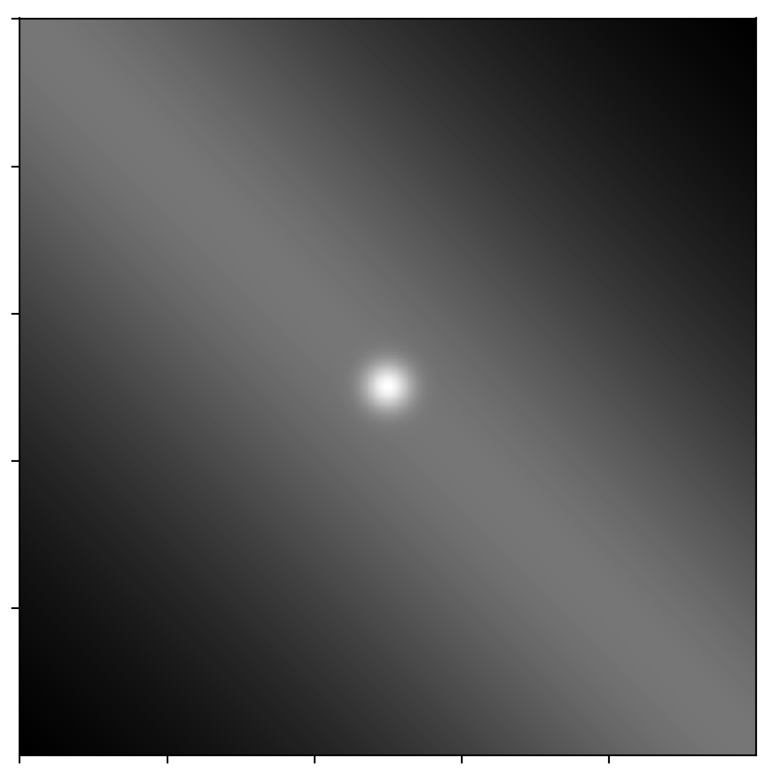
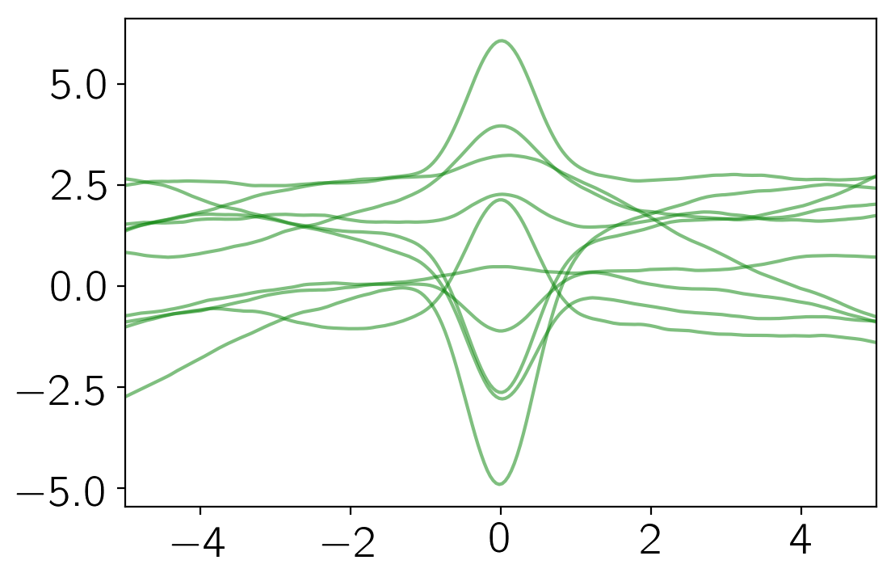

.. note:: This tutorial was generated from an IPython notebook that can be
          downloaded `here <../../_static/notebooks/new-kernel.ipynb>`_.

.. _new-kernel:

Implementing new kernels
========================

This notebook was made with the following version of george:

.. code:: python

    import george
    george.__version__

.. parsed-literal::

    '0.3.1'

All the kernels used by george must be implemented in C++ with Python
bindings. This means that you need to recompile the code anytime you
want to add a new kernel. This is an unavoidable PITA but—as of version
1.0—george comes with a kernel specification language that is designed
to make this process as painless as possible.

To follow this tutorial, you'll need the development version of george.
You should `follow the instructions here <../quickstart/>`__ to get that
set up and once you can build the code, let's start implementing a new
kernel.

The kernel function
-------------------

In this tutorial, we will work through the implementation of a kernel
that wasn't available in early versions of the code: the
``LocalGaussianKernel``. This kernel has been used by `Ian
Czekala <http://iancze.github.io>`__ in his stellar spectrum fitting
algorithm `Starfish <http://iancze.github.io/Starfish/>`__.

This kernel is not stationary and its value is given by the following
equation:

.. math::

   k(x_i,\,x_j) = \exp \left(
   -\frac{(x_i - x_0)^2 + (x_j - x_0)^2}{2\,w}
   \right)

where the parameters :math:`x_0` and :math:`w` are the location and
width of the Gaussian respectively. We're actually going to parameterize
this kernel using :math:`\ln w` instead of :math:`w` because it must be
strictly positive.

In our implementation, we'll also need the derivatives of this function
with respect to the hyperparameters so let's list those now:

.. math::

   \frac{\mathrm{d}k(x_i,\,x_j)}{\mathrm{d}x_0} = \exp \left(
   -\frac{(x_i - x_0)^2 + (x_j - x_0)^2}{2\,w}
   \right) \, \frac{x_i + x_j - 2\,x_0}{w}

and

.. math::

   \frac{\mathrm{d}k(x_i,\,x_j)}{\mathrm{d}\ln w} = \exp \left(
   -\frac{(x_i - x_0)^2 + (x_j - x_0)^2}{2\,w}
   \right) \, \frac{(x_i - x_0)^2 + (x_j - x_0)^2}{2\,w} \quad.

Kernel specification
--------------------

In the root directory of your development version of george, there
should be a directory called ``kernels``. In this directory, create a
new file called ``MyLocalGaussian.yml`` and edit it to have the
following contents:

::

    name: MyLocalGaussianKernel
    doc: You should always document your code.
    stationary: false
    params: [x0, log_w]

    reparams:
        inv_2w: return 0.5 * exp(-log_w);

    value: |
        double d1 = x1 - x0, d2 = x2 - x0;
        return exp(-(d1*d1 + d2*d2) * inv_2w);

    grad:
        x0: |
            double d1 = x1 - x0, d2 = x2 - x0;
            return 2 * exp(-(d1*d1 + d2*d2) * inv_2w) * inv_2w * (d1 + d2);
        log_w: |
            double d1 = x1 - x0, d2 = x2 - x0,
                   arg = (d1*d1 + d2*d2) * inv_2w;
            return exp(-arg) * arg;
        x1: |
            double d1 = x1 - x0, d2 = x2 - x0;
            return -2.0 * exp(-(d1*d1 + d2*d2) * inv_2w) * d1 * inv_2w;
        x2: |
            double d1 = x1 - x0, d2 = x2 - x0;
            return -2.0 * exp(-(d1*d1 + d2*d2) * inv_2w) * d2 * inv_2w;

This file is written in a markup language called YAML and there are a
lot of online resources for the details of the syntax but let's go
through it line-by-line now to explain what's going on.

1. The ``name`` field is the name that you want the Python class to
   have. The convention is to have it end in ``Kernel`` but I guess you
   can call it more-or-less anything.

2. The ``doc`` field let's you write a docstring for the class. This is
   always a good idea and you can look at the existing kernels for
   inspiration.

3. This kernel is not stationary and you specify that using the
   ``stationary`` field.

4. ``params`` lists the "natural" parameters of the kernel. The
   derivatives should be computed with respect to these parameters.

5. It is often useful (for speed) to pre-compute a reparameterized form
   of the parameters. In this case, we don't want to make too many calls
   to the ``exp`` function so we'll pre-compute :math:`(2\,w)^{-1}`. To
   do this, we add an entry to the ``reparams`` dictionary with raw C++
   code for a function that returns the reparameterization. This
   function will take the natural parameters as input so you can use
   them directly by name.

6. The ``value`` entry gives the raw C++ code for evaluating the kernel
   function at input ``double``\ s ``x1`` and ``x2``. This function will
   take the parameters and the reparameterizations as inputs so you can
   use them by name.

7. Finally, the ``grad`` dictionary gives the raw C++ code for computing
   the gradient as a function of each parameter.

After you save this file and recompile george, you should now have
access to this kernel as follows:

.. code:: python

    import numpy as np
    from george import kernels
    
    kernel = 5 * kernels.MyLocalGaussianKernel(x0=0.0, log_w=np.log(0.2))
    kernel += 5 * kernels.Matern32Kernel(100.0)

Whenever you implement a new kernel, you should numerically test that
you've implemented the gradients correctly. The ``Kernel``
implementation includes a function for doing exactly that and here's how
you would call it:

.. code:: python

    x = np.linspace(-10, 10, 500)
    kernel.test_gradient(np.atleast_2d(x).T)

If our implementation was wrong, this would have raised an exception so
this looks pretty promising!

Now, we can plot the covariance matrix given by this kernel as follows:

.. code:: python

    import matplotlib.pyplot as pl
    
    k = kernel.get_value(np.atleast_2d(x).T)
    pl.figure(figsize=(6, 6))
    pl.imshow(k, cmap="gray", interpolation="nearest")
    pl.gca().set_xticklabels([])
    pl.gca().set_yticklabels([]);

From this covariance function, we can sample some representative
functions:

.. code:: python

    np.random.seed(123)
    gp = george.GP(kernel)
    gp.compute(x)
    y = gp.sample(size=10)
    
    pl.plot(x, y.T, "g", lw=1.5, alpha=0.5)
    pl.xlim(-5, 5);

George already includes an implementation of this kernel (called the
``LocalGaussianKernel``) so we'll finish here but when you implement
your own favorite kernel, you should now open a pull request to include
the kernel in the released version of george.

