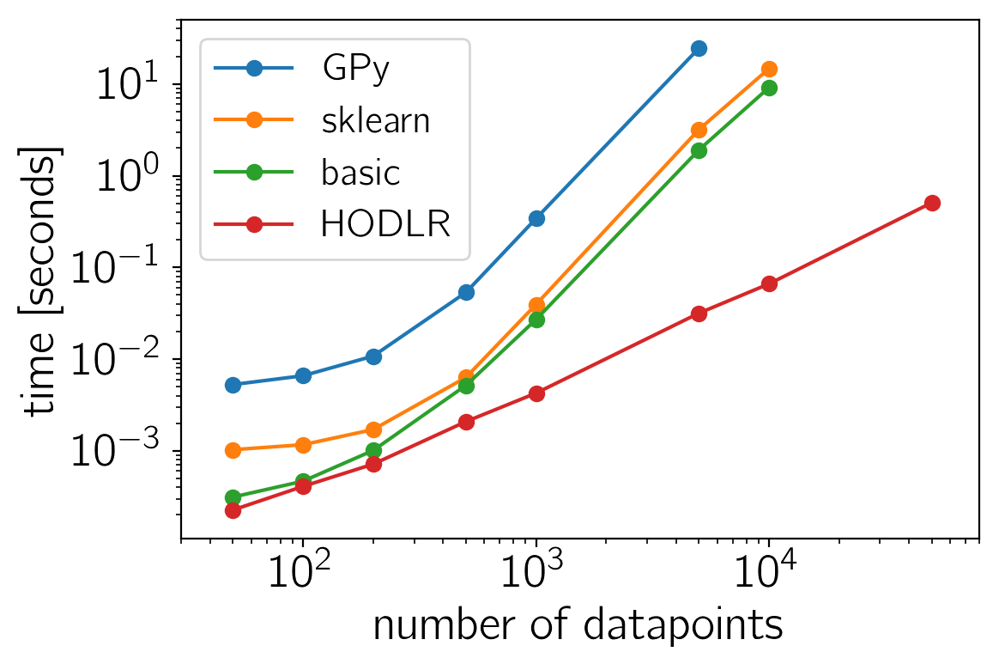

.. note:: This tutorial was generated from an IPython notebook that can be
          downloaded `here <../../_static/notebooks/scaling.ipynb>`_.

.. _scaling:

Scaling Gaussian Processes to big datasets
==========================================

This notebook was made with the following version of george:

.. code:: python

    import george
    george.__version__

.. parsed-literal::

    '0.3.1'

One of the biggest technical challenges faced when using Gaussian
Processes to model big datasets is that the computational cost naïvely
scales as :math:`\mathcal{O}(N^3)` where :math:`N` is the number of
points in you dataset. This cost can be prohibitive even for moderately
sized datasets. There are a lot of methods for making these types of
problems tractable by exploiting structure or making approximations.
George comes equipped with one approximate method with controllable
precision that works well with one-dimensional inputs (time series, for
example). The method comes from `this
paper <http://arxiv.org/abs/1403.6015>`__ and it can help speed up
many—but not all—Gaussian Process models.

To demonstrate this method, in this tutorial, we'll benchmark the two
Gaussian Process "solvers" included with george. For comparison, we'll
also measure the computational cost of the same operations using the
popular `GPy library <https://github.com/SheffieldML/GPy>`__ and the
`new scikit-learn
interface <https://github.com/scikit-learn/scikit-learn/pull/4270>`__.
Note that GPy is designed a Gaussian Process toolkit and it comes with a
huge number state-of-the-art algorithms for the application of Gaussian
Processes and it is not meant for efficiently computing marginalized
likelihoods so the comparison isn't totally fair.

As usual, we'll start by generating a large fake dataset:

.. code:: python

    import numpy as np
    import matplotlib.pyplot as pl
    
    np.random.seed(1234)
    x = np.sort(np.random.uniform(0, 10, 50000))
    yerr = 0.1 * np.ones_like(x)
    y = np.sin(x)

The standard method for computing the marginalized likelihood of this
dataset under a GP model is:

.. code:: python

    from george import kernels
    kernel = np.var(y) * kernels.ExpSquaredKernel(1.0)
    
    gp_basic = george.GP(kernel)
    gp_basic.compute(x[:100], yerr[:100])
    print(gp_basic.log_likelihood(y[:100]))

.. parsed-literal::

    133.946394912

When using only 100 data points, this computation is very fast but we
could also use the approximate solver as follows:

.. code:: python

    gp_hodlr = george.GP(kernel, solver=george.HODLRSolver, seed=42)
    gp_hodlr.compute(x[:100], yerr[:100])
    print(gp_hodlr.log_likelihood(y[:100]))

.. parsed-literal::

    133.946394912

The new scikit-learn interface is quite similar (you'll need to install
a recent version of scikit-learn to execute this cell):

.. code:: python

    import sklearn
    print("sklearn version: {0}".format(sklearn.__version__))
    from sklearn.gaussian_process.kernels import RBF
    from sklearn.gaussian_process import GaussianProcessRegressor
    
    kernel_skl = np.var(y) * RBF(length_scale=1.0)
    gp_skl = GaussianProcessRegressor(kernel_skl,
                                      alpha=yerr[:100]**2,
                                      optimizer=None,
                                      copy_X_train=False)
    gp_skl.fit(x[:100, None], y[:100])
    print(gp_skl.log_marginal_likelihood(kernel_skl.theta))

.. parsed-literal::

    sklearn version: 0.19.1
    133.946394918

To implement this same model in GPy, you would do something like (I've
never been able to get the heteroscedastic regression to work in GPy):

.. code:: python

    import GPy
    
    print("GPy version: {0}".format(GPy.__version__))
    kernel_gpy = GPy.kern.RBF(input_dim=1, variance=np.var(y), lengthscale=1.)
    gp_gpy = GPy.models.GPRegression(x[:100, None], y[:100, None], kernel_gpy)
    gp_gpy['.*Gaussian_noise'] = yerr[0]**2
    print(gp_gpy.log_likelihood())

.. parsed-literal::

    GPy version: 1.8.4
    133.946345613

Now that we have working implementations of this model using all of the
different methods and modules, let's run a benchmark to look at the
computational cost and scaling of each option. The code here doesn't
matter too much but we'll compute the best-of-"K" runtime for each
method where "K" depends on how long I'm willing to wait. This cell
takes a few minutes to run.

.. code:: python

    import time
    
    ns = np.array([50, 100, 200, 500, 1000, 5000, 10000, 50000], dtype=int)
    t_basic = np.nan + np.zeros(len(ns))
    t_hodlr = np.nan + np.zeros(len(ns))
    t_gpy = np.nan + np.zeros(len(ns))
    t_skl = np.nan + np.zeros(len(ns))
    for i, n in enumerate(ns):
        # Time the HODLR solver.
        best = np.inf
        for _ in range(100000 // n):
            strt = time.time()
            gp_hodlr.compute(x[:n], yerr[:n])
            gp_hodlr.log_likelihood(y[:n])
            dt = time.time() - strt
            if dt < best:
                best = dt
        t_hodlr[i] = best
        
        # Time the basic solver.
        best = np.inf
        for _ in range(10000 // n):
            strt = time.time()
            gp_basic.compute(x[:n], yerr[:n])
            gp_basic.log_likelihood(y[:n])
            dt = time.time() - strt
            if dt < best:
                best = dt
        t_basic[i] = best
        
        # Compare to the proposed scikit-learn interface.
        best = np.inf
        if n <= 10000:
            gp_skl = GaussianProcessRegressor(kernel_skl,
                                              alpha=yerr[:n]**2,
                                              optimizer=None,
                                              copy_X_train=False)
            gp_skl.fit(x[:n, None], y[:n])
            for _ in range(10000 // n):
                strt = time.time()
                gp_skl.log_marginal_likelihood(kernel_skl.theta)
                dt = time.time() - strt
                if dt < best:
                    best = dt
        t_skl[i] = best
    
        # Compare to GPy.
        best = np.inf
        for _ in range(5000 // n):
            kernel_gpy = GPy.kern.RBF(input_dim=1, variance=np.var(y), lengthscale=1.)
            strt = time.time()
            gp_gpy = GPy.models.GPRegression(x[:n, None], y[:n, None], kernel_gpy)
            gp_gpy['.*Gaussian_noise'] = yerr[0]**2
            gp_gpy.log_likelihood()
            dt = time.time() - strt
            if dt < best:
                best = dt
        t_gpy[i] = best

Finally, here are the results of the benchmark plotted on a logarithmic
scale:

.. code:: python

    pl.loglog(ns, t_gpy, "-o", label="GPy")
    pl.loglog(ns, t_skl, "-o", label="sklearn")
    pl.loglog(ns, t_basic, "-o", label="basic")
    pl.loglog(ns, t_hodlr, "-o", label="HODLR")
    pl.xlim(30, 80000)
    pl.ylim(1.1e-4, 50.)
    pl.xlabel("number of datapoints")
    pl.ylabel("time [seconds]")
    pl.legend(loc=2, fontsize=16);

The sklearn and basic solver perform similarly with george being
consistently slightly faster. This is not surprising because they both
use LAPACK (via numpy/scipy) to naïvely compute the likelihood. GPy is
consistently slower (probably because of Python overheads) even for
small datasets but, like I mentioned previously, this wasn't really what
GPy was designed to do and it comes with a lot of other features. For
large datasets (:math:`N \gtrsim 1000`), the ``HODLRSolver`` really
shines. In practice, this gain is less significant for multidimensional
inputs and some other kernels but for reasonably well-behaved
time-series models, it might solve all of your problems!

